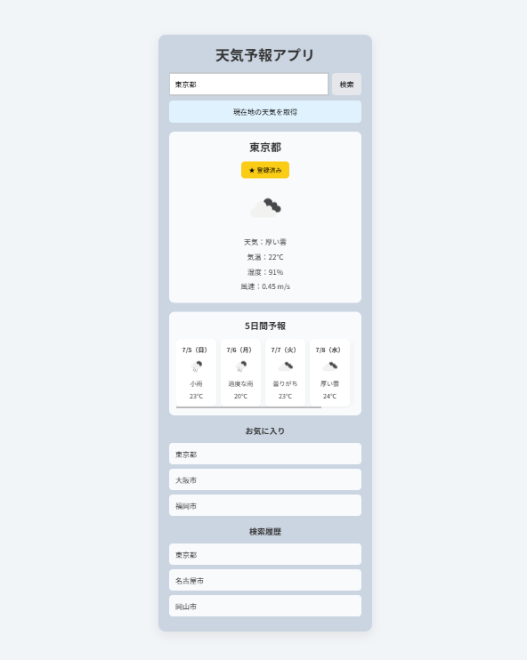
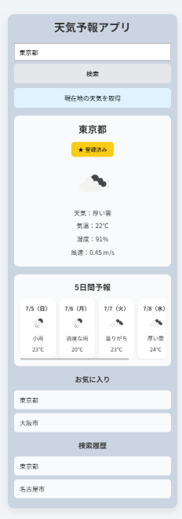

# Weather App（React版）

React + Vite を使用して作成した天気予報アプリです。  
OpenWeather API と ZipCloud API を利用し、現在の天気情報・5日間予報・郵便番号検索・お気に入り登録・検索履歴機能を実装しています。

---

## プロジェクト概要

本アプリケーションは React + Vite を使用した天気予報アプリです。

JavaScript版で実装した天気予報アプリを、保守性・拡張性向上を目的として React + Vite で再構築しました。

コンポーネント分割、カスタムフック、状態管理を利用し、機能追加や再利用がしやすい構成を意識しています。

---

## アプリ画面

### PC表示



### モバイル表示



---

## 主な機能

- 都市名検索
- 都道府県名検索
- 郵便番号検索
- 現在地の天気取得
- 現在の天気表示
- 5日間予報表示
- 天気アイコン表示
- 気温・湿度・風速表示
- お気に入り登録
- 検索履歴表示
- 履歴・お気に入りクリックによる再検索
- 天候による背景色変更
- レスポンシブ対応

---

## 使用技術

- React
- Vite
- JavaScript
- CSS
- LocalStorage
- OpenWeather API
- ZipCloud API

---

## 技術選定理由

### React

コンポーネント分割や状態管理の学習を目的として採用しました。

### Vite

高速な開発環境構築およびビルド環境として採用しました。

### OpenWeather API

外部APIを利用した天気情報取得および非同期処理の学習を目的として採用しました。

### ZipCloud API

日本の郵便番号から住所情報を取得し、郵便番号検索機能を実装するために採用しました。

---

## セットアップ方法

### リポジトリをクローン

```bash
git clone https://github.com/shimodum/react-weather-app.git
```

### プロジェクトへ移動

```bash
cd react-weather-app
```

### パッケージインストール

```bash
npm install
```

### 開発サーバ起動

```bash
npm run dev
```

### ブラウザアクセス

以下URLへアクセスしてください。

```txt
http://localhost:5173
```

---

## API設定

本アプリケーションでは OpenWeather API を使用しています。

OpenWeather API：  
https://openweathermap.org/api

APIキー取得後、`src/api/config.js` を作成し、以下を設定してください。

```javascript
export const API_KEY = "YOUR_API_KEY";
```

サンプルファイルを用意しています。

```txt
src/api/config.example.js
```

以下コマンドでコピーできます。

```bash
cp src/api/config.example.js src/api/config.js
```

※ `weatherApi.js` から `config.js` を読み込む実装のため、この名前で作成してください。  
※ `config.js` は Git 管理対象外です。  
※ APIキーは公開リポジトリへアップロードしないよう注意してください。

---

## ディレクトリ構成

```txt
react-weather-app
├── public
│
├── src
│   ├── api
│   │   ├── cityMap.js
│   │   ├── config.example.js
│   │   └── weatherApi.js
│   │
│   ├── components
│   │   ├── FavoriteButton.jsx
│   │   ├── FavoriteList.jsx
│   │   ├── ForecastList.jsx
│   │   ├── HistoryList.jsx
│   │   ├── SearchForm.jsx
│   │   └── WeatherCard.jsx
│   │
│   ├── hooks
│   │   ├── useFavorites.js
│   │   ├── useHistory.js
│   │   └── useWeather.js
│   │
│   ├── App.css
│   ├── App.jsx
│   ├── index.css
│   └── main.jsx
│
├── images
│   ├── pc.png
│   └── mobile.png
│
├── package.json
├── vite.config.js
└── README.md
```

※ 処理の中心となる主要ファイルのみ記載しています。

---

## 工夫した点

### コンポーネント分割

検索フォーム、天気表示、5日間予報、お気に入りボタン、お気に入り一覧、検索履歴をコンポーネントに分割しました。

画面表示の責務を分けることで、保守性と再利用性を高めています。

### カスタムフック利用

天気取得処理、検索履歴管理、お気に入り管理をカスタムフックへ分離しました。

- `useWeather`
- `useHistory`
- `useFavorites`

のように役割ごとに分けることで、コンポーネント側の見通しを良くしています。

### API連携

OpenWeather API を利用して、現在の天気情報と5日間予報を取得しています。

郵便番号検索では、ZipCloud API で住所情報を取得し、取得した都道府県名をもとに OpenWeather API で天気情報を取得しています。

### 郵便番号検索

OpenWeather API 単体では日本の郵便番号検索が安定しない場合があったため、ZipCloud API を組み合わせる構成にしました。

例：

```txt
100-0001
↓
ZipCloud APIで住所取得
↓
東京都
↓
OpenWeather APIで天気情報取得
```

### お気に入り・検索履歴

LocalStorage を使用し、お気に入り地点と検索履歴を保存できるようにしました。

同じ地点が重複登録されないようにし、最新の検索・登録が上に表示されるようにしています。

### ユーザー操作制御

読み込み中は検索ボタン・現在地取得ボタン・入力欄を無効化し、連続クリックや重複リクエストを防止しました。

### UI統一

JavaScript版とReact版でデザイン・レイアウトを統一し、同じ操作感になるよう調整しました。

### 現在地取得の仕様

現在地取得は緯度・経度を利用して天気情報を取得しています。

取得される地域名が都市名検索で再検索できるとは限らないため、現在地取得で表示された地点はお気に入り登録・検索履歴の対象外としています。

---

## 動作確認項目

以下項目について動作確認を実施しています。

### 検索機能

- 東京で検索できる
- 東京都で検索できる
- 愛知で検索できる
- 100-0001で検索できる
- 1000001で検索できる
- 存在しない都市名でエラー表示される
- 存在しない郵便番号でエラー表示される
- 空入力でエラー表示される

### 天気情報・5日間予報

- 都市検索後に現在の天気情報が表示される
- 都市検索後に5日間予報が表示される
- 郵便番号検索後に現在の天気情報が表示される
- 郵便番号検索後に5日間予報が表示される
- 現在地取得後に現在の天気情報が表示される
- 現在地取得後に5日間予報が表示される

### お気に入り

- 都市検索時はお気に入り登録できる
- 郵便番号検索時はお気に入り登録できる
- 現在地取得時はお気に入りボタンが表示されない
- お気に入り一覧クリックで再検索できる
- お気に入り解除で一覧から削除される
- 再読み込み後もお気に入りが保持される

### 検索履歴

- 検索した地点が履歴に追加される
- 同一地点検索時に重複登録されない
- 最新検索が先頭に表示される
- 検索履歴クリックで再検索できる
- 現在地取得時は検索履歴に追加されない
- 再読み込み後も検索履歴が保持される

### UI

- PC表示でレイアウトが崩れない
- スマートフォン表示でレイアウトが崩れない
- 天候に応じて背景色が変更される（晴れ・曇り・雨・雪に対応）
- 読み込み中メッセージが表示される
- 読み込み中は検索ボタン・現在地取得ボタン・入力欄が無効化される
- ボタンの hover 表示が不自然にならない
- 空入力時に前回の天気情報・5日間予報が残らない

---

## 学習ポイント

本アプリ制作を通じて以下を学習しました。

- Reactコンポーネント設計
- useState / useEffect
- カスタムフック作成
- OpenWeather APIとの連携
- ZipCloud APIとの連携
- fetch を利用した非同期通信
- Promise.all を利用した並列処理
- LocalStorage利用
- レスポンシブデザイン
- JavaScript版からReact版へのリファクタリング
- APIキー管理
- エラーハンドリング

---

## 今後の改善点

- ローディングアニメーション追加
- 地図連携
- TypeScript化
- 現在地取得地点のお気に入り登録対応
- エラーハンドリング強化

---

## 補足

OpenWeather API の仕様により、入力した都市名と表示される都市名が異なる場合があります。

例：

- 東京 → 東京都
- 大阪 → 大阪市
- Kyoto → 京都市

本アプリでは API のレスポンス結果をそのまま表示しているため、地域名の表記が統一されない場合があります。

日本語での検索性向上のため、都道府県名を入力した場合は、県庁所在地へ変換したうえで検索しています。

例：

- 愛知 → 名古屋
- 神奈川 → 横浜
- 沖縄 → 那覇

郵便番号検索では、ZipCloud API で住所を取得し、取得した都道府県名をもとに天気情報を検索しています。

現在地取得ではブラウザ位置情報と OpenWeather API を利用しているため、実際の現在地と完全一致しない地域名が表示される場合があります。

また、現在地取得で表示された地点名が都市名検索で再検索できるとは限らないため、現在地取得で表示された地点はお気に入り登録・検索履歴の対象外としています。